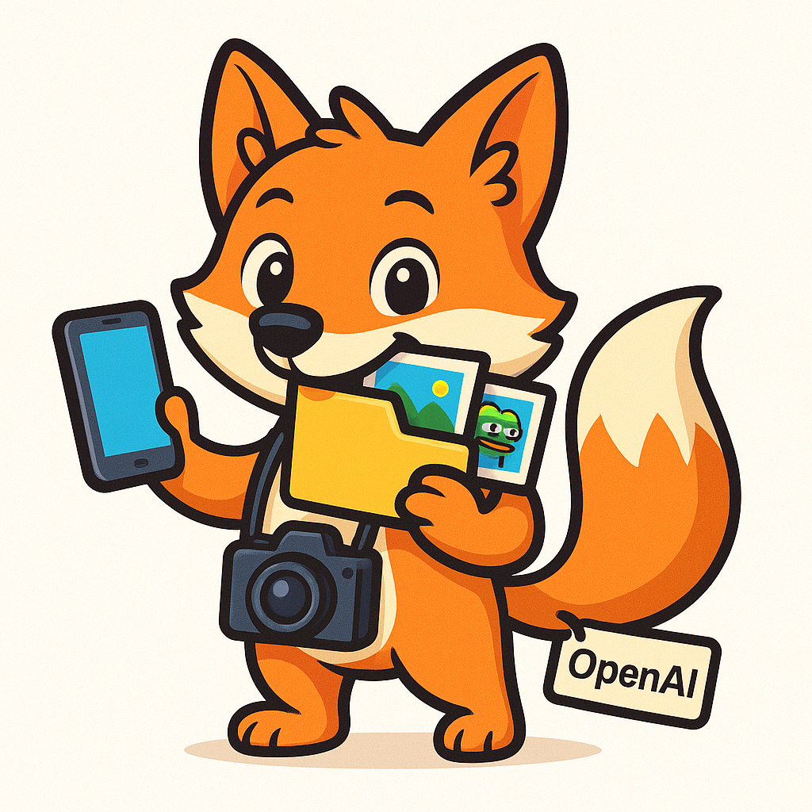

# posterAndGrabberBot



A powerful Go bot for grabbing media from VK (VKontakte) public pages, generating captions with OpenAI, and posting content automatically to a Telegram channel.

---

## ✨ Features

- Parses and downloads photos and videos from VK public groups.
- Supports filtering posts by keywords.
- Automatically posts media to a Telegram channel at a configurable interval.
- Generates fun captions with OpenAI (supports GPT-4o and others).
- Easy configuration via a single config file or environment variables.
- Healthcheck endpoint at `/healthz`.
- Can be run locally or in Docker.

---

## 🛠 Configuration

The bot is configured via a config file (TOML/YAML/ENV). Example TOML:

```toml
telegram_bot_token     = "YOUR_TELEGRAM_BOT_TOKEN"
telegram_channel_id    = -1001234567890

database_dsn          = ""
fetch_interval        = "10m"
notification_interval = "1m"

filter_keywords       = ["реклама", "ad", "promo"]

openai_key            = "sk-..."
openai_prompt         = "Make a meme caption for the image"
openai_model          = "gpt-4o"
images_directory      = "./media"
vk_token              = "YOUR_VK_API_TOKEN"
```

- telegram_bot_token — Telegram Bot API token.
- telegram_channel_id — Channel ID (use negative format for channels, e.g. -1001234567890).
- database_dsn — Optional, Postgres connection string (if you want to store history, not required for basic usage).
- fetch_interval — How often to grab new posts from VK (e.g., 10m).
- notification_interval — How often to post a new image/video to Telegram (e.g., 1m).
- filter_keywords — List of keywords to filter posts (case-insensitive).
- openai_key — OpenAI API key (for caption generation).
- openai_prompt — Prompt template for OpenAI (e.g., "Make a meme caption for the image").
- openai_model — OpenAI model (e.g., "gpt-4o", "gpt-3.5-turbo").
- images_directory — Local directory for storing downloaded media files.
- vk_token — VK API token (get from VK developers portal).

## 🚀 Quick Start
### 1. Clone the repository
```Bash
git clone https://github.com/digkill/posterAndGrabberBot.git
cd posterAndGrabberBot
```

### 2. Install dependencies
Requires Go 1.20+ and ffmpeg (for processing video thumbnails).
```Bash
go mod tidy
```

### 3. Prepare configuration
Edit your config file or export variables as environment variables.
Example with env vars:

```
export TELEGRAM_BOT_TOKEN=your_telegram_bot_token
export TELEGRAM_CHANNEL_ID=-1001234567890
export VK_TOKEN=your_vk_token
export OPENAI_KEY=sk-...
export OPENAI_MODEL=gpt-4o
export OPENAI_PROMPT="Make a meme caption for the image"
export IMAGES_DIRECTORY=./media
export FETCH_INTERVAL=10m
export NOTIFICATION_INTERVAL=1m
export FILTER_KEYWORDS='["ad","promo"]'
```
Or copy the example TOML/YAML config and fill in your values.

### 4. Run the bot

```Bash
go run ./cmd/posterAndGrabberBot/main.go
```

## 🏗 Project Structure
- cmd/posterAndGrabberBot/main.go — Entry point; sets up config, bot, fetchers, poster service, HTTP server.
- internal/fetcher — Fetches posts from VK, applies keyword filters.
- internal/source — Downloads media files (photos, videos, thumbnails) from VK.
- internal/services/poster — Publishes media to Telegram, generates captions with OpenAI.
- internal/helpers — Utilities for media handling, validation, encoding.
- internal/summary — OpenAI API integration.
- internal/models — Data models for VK API and internal structures.

## 🖼️ Workflow
- Fetcher periodically checks VK for new posts and downloads photos and videos.
- Poster service picks a random media file from the directory, generates a caption via OpenAI, and posts it to the Telegram channel.
- After posting, the file is deleted to avoid reposts.
- Healthcheck is available at http://localhost:8881/healthz.

## 🐳 Docker Usage
You can build and run the bot in Docker.
Example Dockerfile:
```YAML
FROM golang:1.21-alpine as builder
WORKDIR /app
COPY . .
RUN go build -o bot ./cmd/posterAndGrabberBot/main.go

FROM alpine:latest
WORKDIR /app
COPY --from=builder /app/bot .
COPY media ./media
CMD ["./bot"]
```

Run with:
```Bash
docker build -t posterandgrabberbot .
docker run --env-file .env posterandgrabberbot
```

## ⚠️ Notes
- ffmpeg must be installed and accessible for video thumbnail generation.
- For best results, run the bot on a server with good network and disk performance.
- Make sure your Telegram bot has permission to post photos and videos to your channel.
- For advanced usage (database, more sources), extend the config and code.

## 🤝 Contributing
Contributions are welcome!
Please open issues or pull requests to suggest features, improvements, or bugfixes.

## 🦊 Author
[digkill](https://github.com/digkill)

Have questions or feature requests? Open an issue or contact the author on Telegram!